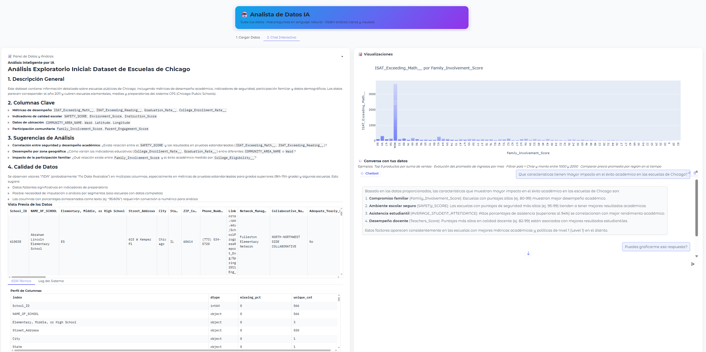

  

  
  
  
  
  
  
  
  
  
  

Este proyecto es un potente **Analista de Datos IA** que permite conversar con archivos CSV o Excel. Sube tus datos y la aplicación se encarga del resto: limpieza automática, perfilado, uniones entre tablas y un **Análisis Exploratorio (EDA) generado por IA**. Haz preguntas complejas ey recibe respuestas claras, tablas y gráficos dinámicos al instante.

  <a href="https://huggingface.co/spaces/Ricardouchub/analista-de-datos" target="_blank"><b>Analista de Datos IA</b></a>

  

---

## Características Principales

- **Múltiples archivos**: Soporte para uno o más archivos CSV/Excel.
- **Joins automáticos**: Al subir múltiples archivos, la app detecta primary keys y sugiere uniones.
- **EDA inteligente y Data Card descargable**: Genera un resumen de los datos (EDA) apenas los subes y permite exportar un **informe completo en Markdown**.
- **Motor de ejecución dual (Pandas/SQL)**: Convierte preguntas en un plan de ejecución JSON (o un plan tipado con PydanticAI) que se ejecuta con **Pandas** por defecto o con **DuckDB (SQL)** activando un simple *toggle*.
- **Memoria conversacional**: Recuerda el contexto de las últimas preguntas para un análisis más fluido.
- **Búsqueda semántica de columnas**: Entiende el contexto de tu pregunta aunque no se use el nombre exacto de la columna, gracias a un sistema híbrido de **Sentence-Transformers (FAISS) y RapidFuzz**.
- **Visualización dinámica**: Genera gráficos (barras, líneas, scatter, etc.) con Plotly cuando la pregunta lo amerita.
- **Estabilidad y telemetría**: Incluye caché de consultas, límites de uso por sesión, contador de latencia y cooldown anti-spam.

---

## Guía de la Interfaz

- **Pestaña 1 – Cargar Datos**
  - Sube uno o varios archivos CSV/Excel.
  - Automáticamente se ejecuta la limpieza, el perfilado y el **EDA inteligente (IA)**.
  - Usa el botón **“Exportar Data Card (Markdown)”** para descargar el reporte completo.

- **Pestaña 2 – Chat Interactivo**
  - **Izquierda**: Panel de Datos con perfil técnico, vista previa, matriz de correlación y logs.
  - **Derecha**: Área de visualizaciones y chat.
  - **Activa el toggle DuckDB (SQL)** para ejecutar el plan en SQL. Verás la consulta SQL generada, la explicación del plan y la telemetría (latencia y filas procesadas).
  - **Preguntas de ejemplo**:
    - *Top 5 productos por suma de ventas*
    - *Evolución del promedio de ingresos por mes*
    - *Filtrar país = Chile y monto entre 1000 y 2000*
    - *Comparar precio promedio por región en el tiempo*

---

## Stack

- **Interfaz**: Gradio
- **Backend y Manipulación de Datos**: Python, Pandas
- **Motor SQL (Opcional)**: DuckDB
- **Visualización**: Plotly
- **IA (LLM)**: DeepSeek
- **Agente**: PydanticAI 
- **Embeddings y Búsqueda Vectorial**: Sentence-Transformers y FAISS

---

## Configuración y Límites

- **Tamaño por archivo**: 25 MB (ajustable en `build_dataset_flow`).
- **Filas totales**: 200,000 (ajustable).
- **Consultas por sesión**: 20 (ajustable).
- **Tipos de gráfico soportados**: `bar`, `line`, `scatter`, `pie` (con auto-selección si no se especifica).
- **Compatibilidad**: Gradio **5.43.1**.

---

## Screenshots

---

## Autor

**Ricardo Urdaneta**

**[Linkedin](https://www.linkedin.com/in/ricardourdanetacastro)**

---
